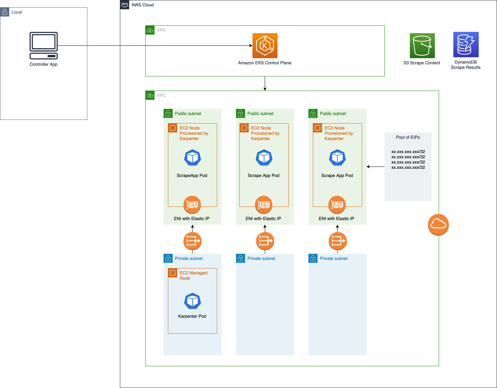

# Web Scrapping Container Environment

This demonstration has the purpose of showing how to develop and implement a webscrapping solution using Containers. The application can deploy webscrapping containers into either EKS or ECS, each container will scrape its own URL defined by Controller Application.

# Pre reqs

- kubectl
- awscli
- Pre Configured AWS auth (Access Key and Secret Key)
- Terraform 1.3.3 >
- Docker and Docker Compose

# EKS Architecture Diagram

 

