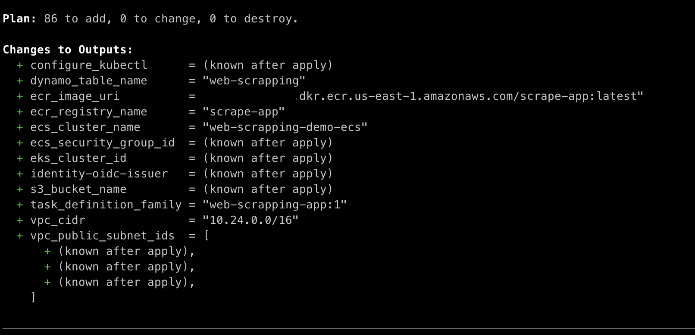
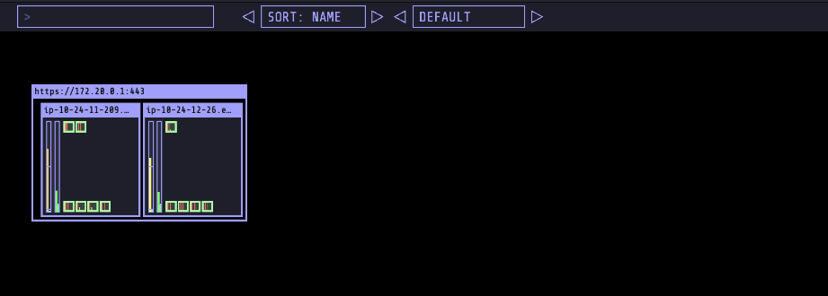
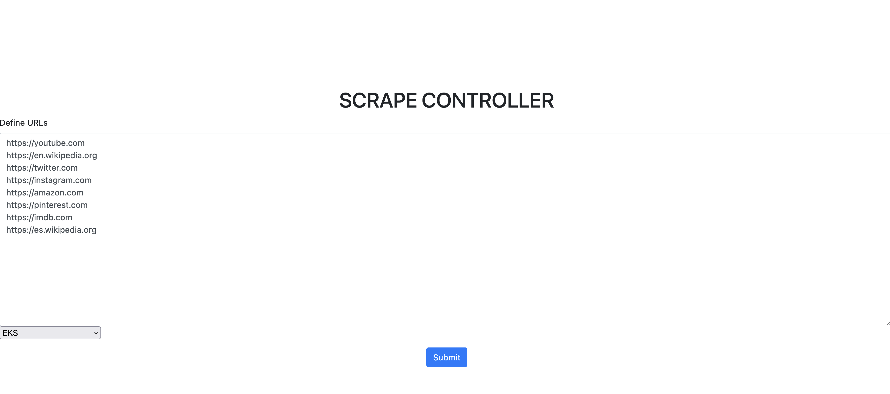
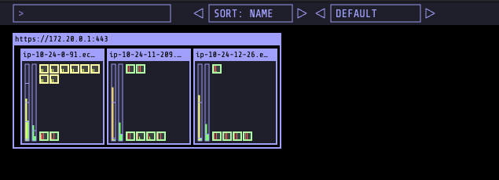
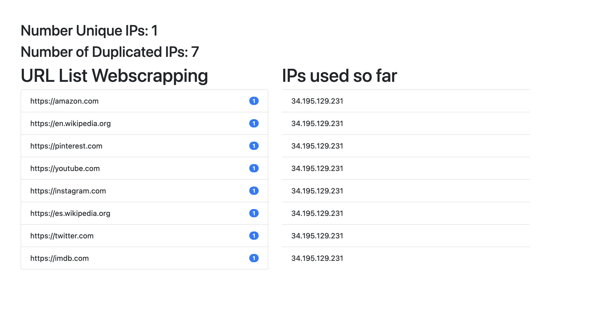

This demonstration has the purpose of showing how to develop and implement a webscrapping solution using Containers. The application can deploy webscrapping containers into either EKS or ECS, **each container will scrape its own URL defined by Controller Application**.

# Why does this demo exist?

## Scenario
You have webscraping code that you want to run in thousands of ephemeral containers using thousands of unique IPs to scrape websites for potentially malicious code. The life of each container is the duration of the webscraping job. You are working with the constraint that you must use your own pool of  elastic IP address in your VPC and not randomly assigned public IPs. Ideally you want to use AWS Fargate or Lambda services execpt the issue you've hit with is that neither of them support the use of Elastic IPs.

So you want an alternative solution using EC2 based EKS (which does support Elastic IPs) but want the user experience of that service to be similar to Fargate - when it comes to automation of management overhead.

This solution showcases that by demonstrating automation in the following areas:
1. Kubernetes cluster management is automated in two ways:
   * Amazon EKS automates the control plane management including scaling and HA
   * [Karpenter](https://karpenter.sh/) automates worker node management including scaling and HA
2. Container management is automated by Kubernetes including scaling and HA
3. Karpenter itself is deployed as a Kubernets app and hence it's management is managed by Kubernetes (scaling and HA)
4. The residual management overhead that's left for the user is minimal, mostly involving design time concerns like choices for instance types and sizes & observability of infra metrics
 

## Application deployment
The user experience for deploying an application remains the same between this soltution and Fargate-EKS. Users would have to build a application container and submit it to the Kubernetes engine to run.

# Pre reqs

- kubectl
- awscli
- Pre Configured AWS auth (Access Key and Secret Key)
- Terraform 1.3.3 >
- Docker and Docker Compose
- Helm 3 > (Optional)

# Architecture Diagrams

This solution can deploy web-scrapping container apps either on EKS and on ECS.

## EKS Diagram

<p align="center">

</p>

The EKS Architecture consists in the following components:

- **VPC**, with Public and Private subnets, each private subnet has the default route towards the Nat Gateway.
- **EKS Control Plane**, Kubernetes API Server components managed by AWS
- **EKS Managed Node Group**, those Nodes are needed to deploy the first Kubernetes add-ons, such as CoreDNS, Karpenter, Kube-Proxy and so on.
- **Karpenter Pod**, add-on deployed into the EKS cluster that will be responsible to scale the nodes up and down.
- **S3 Bucket**, we are using this bucket to save the scrapped content from the websites.
- **DynamoDB Table**, the DynamoDB table has the purpose of store the IP that we used for do each scrapping and the URL that it scrapped.
- **Controller App**, this application is reponsible for creating the scrapping pods into Kubernetes, **one pod per URL**.
- **Scrape App**, this is the application responsible for scrapping the URLs defined by the controller app, **one pod per URL**.

## ECS

[TBD]

# How does it work?

This demonstration consists in 3 applications.

  1. **Controller App** that is reponsible for provisioning the scrapping containers into EKS or ECS.
  2. **Scrape App** is the application responsible for scrape the URLs defined into the Controller App. Each container will run until scrape completition and it will be scaled down.
  3. **Dashboard App** that is responsible for creating a Dashboard of how many URLs were scrapped and show how many IPs we used.

## EKS Implementation

In the EKS cluster the **Controller App** will apply one scrape application manifest per URL to be scraped (One Pod per URL). In the first moment the pods will remain in **Pending** state. That will trigger **Kapenter** to provision the Nodes to hadle those Pods (Defined into the provision.yaml), since we need Public IPs, Karpenter will provision those Nodes into **Public Subnets**.

During the creation each Node has an [User Data](https://docs.aws.amazon.com/AWSEC2/latest/UserGuide/user-data.html) that is responsible to assignee an **Elastic IP** that is available from your pool of elastic IPs. If you don't have any Elastic IPs available, it will use the Node own Public IP (Since we are launching it into public Subnets).

After the Pods complete their Task, Karpenter will notice that the nodes are idle and will remove it, releasing the Elastic IPs again for use. So with EKS + Karpenter and some automations we can have the Nodes available in less than 120 seconds, **and the amount of Containers that can run in each Node, will depend on how you have configured Karpenter Provisioner** and how much **CPU and Memory** you have defined for you scrape app. That being said, Karpenter can provision more or less Nodes depending on how many it need to handle the workload, each Node has his own Public/Elastic IP, so all the Containers that run in the same Node will use that IP.

## ECS Implementation

In ECS, the **Controller App** calls the AWS API to provision the task into the ECS cluster (One task per URL), we are using **Fargate** host mode for those tasks, and because of that we don't have any servers to manage. Each Fargate task is deployed into a Public Subnet, doing that each Task will have its own Public IP. After the scrape completes, the Fargate task will be scaled down. With that solution we cannot use Elastic Ips, since Fargate doens't supports it.

# Deploying the solution

For deploying the solution we are gonna need to execute few steps, everything in this repository is automated to make it easier to reproduce in any AWS account.

## Deploying using Terraform

We are using [EKS Blueprints](https://github.com/aws-ia/terraform-aws-eks-blueprints) for the EKS componentes, and pure terraform registry aws resources for other resourcers, such as, S3 bucket, DynamoDB table etc.

You can also enable terraform to create extra Elastic IPs if you desire. Set the **eip_config** variable to True and select the number of IPs you need.

```bash
cd terraform
terraform init
```

Terraform init is responsible for initializing the resources, now let's plan, with `terraform plan` we are able to see the infraestructure changes that are gonna be executed.

```bash
terraform plan -var='aws_region=YOUR_REGION_HERE'
```

Replace the region with your region, you should see an output similar to this:

<p align="center">

</p>

Let's now apply, with `terraform apply` it will create the entire needed infraestructure.

```bash
terraform apply -var='aws_region=YOUR_REGION_HERE' --auto-approve
```

This will take around 20 minutes to execute.

## Testing cluster access

Let's test the clister access by executing the following `kubectl` commands:

```bash
kubectl get nodes
```

## Setup Karpenter Provisioner

In this sample we will use [Karpenter](https://karpenter.sh/) for scaling our Nodes.

Karpenter launches the right compute resources to handle your cluster's applications.

In Karpenter provisioner manifest we specify the instance types, size, capacity type and more, check [this doc](https://karpenter.sh/v0.22.0/concepts/provisioners/) to understand more about Karpenter provisioner.

For the purpose of this demonstration, we are not gonna change the default configuration of the `provisioner.yaml` manifest file.

```bash
cd .. && kubectl apply -f provisioner.yaml
```

## Creating Scrape Application Image

Scrape is the only application that will be executed so we need to create the application image and push it to the ECR repository created by terraform.

```bash
./automation.sh
```

The script requires you to provide the `AWS_ACCOUNT_ID` and `AWS_REGION` you are using.

## Docker Compose

For the purpose of this demonstration, we are running both `Controller Application` and `Dashboard` locally, controllerd by docker-compose.

To run our apps, let's first replace the needed variables on `docker-compose.yml` file, **the values that we need to replace were generated by terraform output.**

```yaml
services:
  controller-app:
      build: ./controller_app
      networks:
        - project-network
      ports:
        - "3000:5000"
      restart: always
      environment:
        AWS_ACCESS_KEY_ID: YOU HAVE TO CREATE IT (REPLACE)
        AWS_SECRET_ACCESS_KEY: YOU HAVE TO CREATE IT (REPLACE)
        AWS_DEFAULT_REGION: REGION DEFINED IN TERRAFORM (REPLACE)
        EKS_CLUSTER_NAME: web-scrapping-demo
        ECS_CLUSTER_NAME: web-scrapping-demo-ecs
        SCRAPE_IMAGE_URI: ecr_image_uri (REPLACE)
        BUCKET_NAME: s3_bucket_name (REPLACE)
        DYNAMO_DB_TABLE_NAME: web-scrapping
        PUBLIC_SUBNETS: vpc_public_subnet_ids (REPLACE)
        SECURITY_GROUPS: ecs_security_group_id (REPLACE)
        TASK_DEFINITION: web-scrapping-app:1
  dashboard-app:
      depends_on:
        - controller-app
      build: ./dashboard
      networks:
        - project-network
      ports:
        - "5000:5000"
      restart: always
      environment:
        AWS_ACCESS_KEY_ID: YOU HAVE TO CREATE IT (REPLACE)
        AWS_SECRET_ACCESS_KEY: YOU HAVE TO CREATE IT (REPLACE)
        AWS_DEFAULT_REGION: REGION DEFINED IN TERRAFORM (REPLACE)
        DYNAMO_DB_TABLE: web-scrapping
networks:
  project-network:
    driver: bridge
```

After filling the environemnt variables, it is time to execute the application locally.

```bash
docker-compose up --build
```

You should see the following result.

```
NAME                           STATUS                     ROLES    AGE   VERSION
ip-10-24-11-209.ec2.internal   Ready,SchedulingDisabled   <none>   62m   v1.23.13-eks-fb459a0
ip-10-24-12-26.ec2.internal    Ready,SchedulingDisabled   <none>   62m   v1.23.13-eks-fb459a0
```

`SchedulingDisabled` status, it means that we are going to force Karpenter to provision new Nodes to handle the Scape application pods.

## Installing kube-ops-view (Optional)

Kube-ops-view provides a common operational picture for a Kubernetes cluster that helps with understanding our cluster setup in a visual way.

```bash
helm install kube-ops-view christianknell/kube-ops-view --set service.type=LoadBalancer --set rbac.create=True
```

Kube ops view, will make easier to see how karpenter deals with scaling nodes to handle the scrape pods.

It will deploy a LoadBalancer type service, to get the URL execute the following command.

```bash
kubectl get svc kube-ops-view | awk '{print $4}' | grep -vi external
```

Open the URL into your browser, it should look like the following.

<p align="center">

</p>

## Executing the Application

To guarantee that Karpenter will scale new nodes when we create the scrapping pods, let's cordon the nodes of the managed node groups, by executing the following command.

```bash
kubectl cordon $(kubectl get nodes | awk '{print $1}' | grep -vi name | xargs) && kubectl get nodes
```

Open in your browser the following URL, http://localhost:3000/. This URL directs you to the controller interface which is where we are going to define the URLs for our application to scrape.

In the text box, let's define the URLs and where we want to execute, in our case `EKS`. It should look like the following.

Check below some sample URLs for testing
https://github.com/lusoal/web-scrapping-container-environment/blob/3ec3cee91a005cde331cc00becdb5f397bac5ab3/urls.txt

<p align="center">

</p>

After defining the URLs for scarapping, submit the request.

You can check what is happenning behind the scenes either using `kubectl get nodes && kubectl get pods` or via kube-ops-view if you opted for installing it.

<p align="center">

</p>

You will notice that a new node was already provisioned by `Karpenter` and `Kube Scheduler` already have placed the `scrape pods`, **the amount of nodes will depends on how many CPU and Memory we have defined for our application, and what are the instance types that we've defined on Karpenter provisioner.**

The pods will run until completion, after this, `Karpenter` will notice that the Node is not needed anymore and scale down the replicas.

### Dashboard Application

The Dashboard application in responsible to give you ability to visualize what URLs were scrapped by the Pods and also which IP it used for scrapping. Just open http://localhost:5000

<p align="center">

</p>

# Cleaning

First check for the name of the bucket and the ECR repo created in the automation. Update the ```data_clean_up.sh``` script with the resources names and region and run.


```bash
./data_clean_up.sh
```

After the files and images are removed, delete the remaining infrastructure:

```bash
cd terraform
terraform apply -var='aws_region=YOUR_REGION_HERE' --auto-approve
```

This process may take several minutes.
